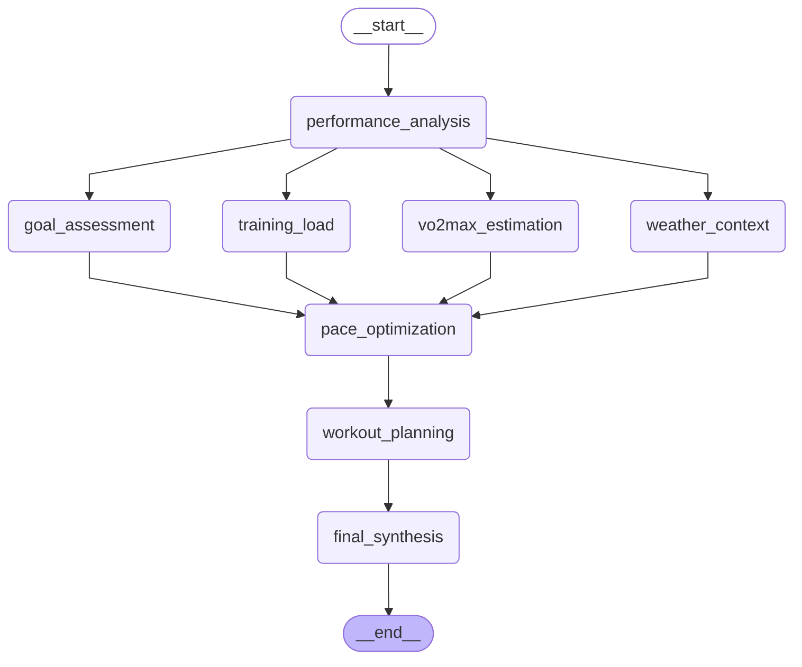

# Workflow Diagram

```mermaid
---
config:
  flowchart:
    curve: linear
---
graph TD;
	__start__([<p>__start__</p>]):::first
	performance_analysis(performance_analysis)
	goal_assessment(goal_assessment)
	pace_optimization(pace_optimization)
	workout_planning(workout_planning)
	weather_context(weather_context)
	vo2max_estimation(vo2max_estimation)
	training_load(training_load)
	final_synthesis(final_synthesis)
	__end__([<p>__end__</p>]):::last
	__start__ --> performance_analysis;
	goal_assessment --> pace_optimization;
	pace_optimization --> workout_planning;
	performance_analysis --> goal_assessment;
	performance_analysis --> training_load;
	performance_analysis --> vo2max_estimation;
	performance_analysis --> weather_context;
	training_load --> pace_optimization;
	vo2max_estimation --> pace_optimization;
	weather_context --> pace_optimization;
	workout_planning --> final_synthesis;
	final_synthesis --> __end__;
	classDef default fill:#f2f0ff,line-height:1.2
	classDef first fill-opacity:0
	classDef last fill:#bfb6fc

```
